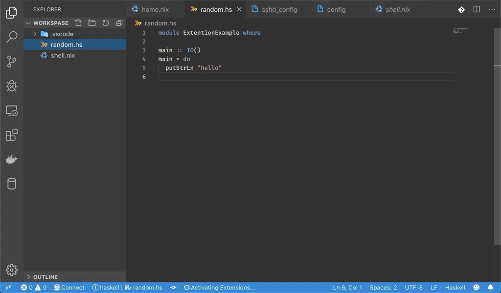
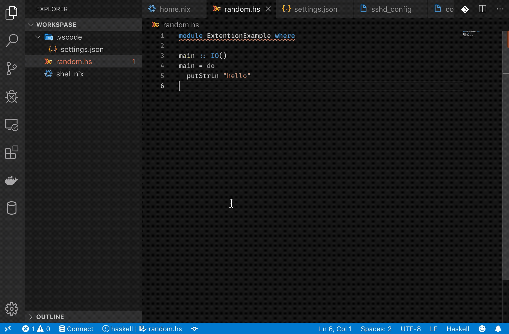

# Nix Environment Selector (🧪 *Experimental Release*)

This extension lets you use environments declared in `.nix` files in Visual Studio Code.

## Motivation

Nix package manager provides a way of creating isolated environments with a specific configuration of packages. These environments are usually activated in the terminal and are not convenient to use within an IDE.

One option is to run `nix-shell` on the command line and then launch `code` within the activated shell. However, this process can quickly become tedious. `Nix Environment Selector` provides an alternative: can automatically apply the environment.

## Getting started

- Install [Nix package manager](https://nixos.org/nix/).
- Restart VS Code (to make sure that `nix-shell` is in the PATH)
- [Install the extension](https://marketplace.visualstudio.com/items?itemName=arrterian.nix-env-selector).
- Create the Nix environment config (like `default.nix` or `shell.nix`) in the root of your project's workspace.
- Open Command Palette (<kbd>Ctrl</kbd> + <kbd>Shift</kbd> + <kbd>P</kbd>) and run `Nix-Env: Select Environment` command.
- Choose the Nix environment you'd like to apply.
- Wait for the environment to build.
- Restart VS Code to apply the built environment.

## Example

### Haskell project

To run a Haskell application you need to have **GHC** (Haskell compiler) installed. With Nix package manager we can create an isolated environment containing only the GHC version and the dependencies that the project needs without polluting the user's environment.

Environment configuration in `shell.nix`:

```nix
{ pkgs ? import <nixpkgs> { } }:
with pkgs;

let
  haskellDeps = ps: with ps; [
    base
    lens
    mtl
    random
  ];
  haskellEnv = haskell.packages.ghc865.ghcWithPackages haskellDeps;
in mkShell {
  buildInputs = [
    haskellEnv
    haskellPackages.cabal-install
    gdb
  ];
}
```

Now let's try to open our project in Visual Studio Code.



As you can see VS Code can't find the GHC compiler. Let's apply the environment declared in `shell.nix`.



Bingo 🎉🎉🎉. Everything is working now 😈

## Configuration

You can configure the extension in `.vscode/settings.json` file (located in the root of the workspace). Here are the configuration settings:

| Setting                             | Default                        | Description                     |
| ----------------------------------- | ------------------------------ | ------------------------------- |
| `nixEnvSelector.nixShellConfig`     | `${workspaceRoot}/default.nix` | Path of the Nix config file     |
| `nixEnvSelector.nixShellConfigAttr` | `undefined`                    | Attribute path (`nix-shell -A`) |

## Supported Platforms

- MacOS
- Linux
- Windows (with `Remote - WSL` extension)

## License

[MIT](LICENSE)
